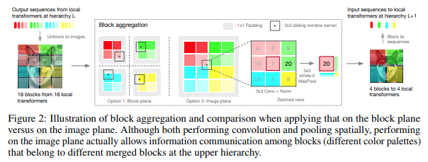

## NesT

</img>

"Hierarchical structures are popular in recent vision transformers, however, they require sophisticated designs and massive datasets to work well. In this paper, we explore the idea of nesting basic local transformers on non-overlapping image blocks and aggregating them in a hierarchical way. We find that the block aggregation function plays a critical role in enabling cross-block non-local information communication. This observation leads us to design a simplified architecture that requires minor code changes upon the original vision transformer. The benefits of the proposed judiciously-selected design are threefold: (1) NesT converges faster and requires much less training data to achieve good generalization on both ImageNet and small datasets like CIFAR; (2) when extending our key ideas to image generation, NesT leads to a strong decoder that is 8× faster than previous transformer-based generators; and (3) we show that decoupling the feature learning and abstraction processes via this nested hierarchy in our design enables constructing a novel method (named GradCAT) for visually interpreting the learned model." - Zizhao Zhang, Han Zhang, Long Zhao, Ting Chen, Sercan O. Arik, Tomas Pfister

### Research Paper:
- https://arxiv.org/abs/2105.12723

### Official repository:
- https://github.com/google-research/nested-transformer

## Acknowledgement:
I have been greatly inspired by the brilliant code of [Dr. Phil 'Lucid' Wang](https://github.com/lucidrains). Please check out his [open-source implementations](https://github.com/lucidrains) of multiple different transformer architectures and [support](https://github.com/sponsors/lucidrains) his work.

## Usage

```python
import numpy

key = jax.random.PRNGKey(0)

img = jax.random.normal(key, (1, 224, 224, 3))

v = NesT(
    image_size = 224,
    patch_size = 4,
    dim = 96,
    heads = 3,
    num_hierarchies = 3,        # number of hierarchies
    block_repeats = (2, 2, 8),  # the number of transformer blocks at each heirarchy, starting from the bottom
    num_classes = 1000
)

init_rngs = {'params': jax.random.PRNGKey(1), 
            'dropout': jax.random.PRNGKey(2)}

params = v.init(init_rngs, img)
output = v.apply(params, img, rngs=init_rngs)
print(output.shape)

n_params_flax = sum(
    jax.tree_leaves(jax.tree_map(lambda x: numpy.prod(x.shape), params))
)
print(f"Number of parameters in Flax model: {n_params_flax}")
```

## Author:
- Enrico Shippole

## Citations:
```bibtex
@misc{zhang2021aggregating,
    title   = {Aggregating Nested Transformers},
    author  = {Zizhao Zhang and Han Zhang and Long Zhao and Ting Chen and Tomas Pfister},
    year    = {2021},
    eprint  = {2105.12723},
    archivePrefix = {arXiv},
    primaryClass = {cs.CV}
}
```
```bibtex
@software{flax2020github,
  author = {Jonathan Heek and Anselm Levskaya and Avital Oliver and Marvin Ritter and Bertrand Rondepierre and Andreas Steiner and Marc van {Z}ee},
  title = {{F}lax: A neural network library and ecosystem for {JAX}},
  url = {http://github.com/google/flax},
  version = {0.5.0},
  year = {2020},
}
```
```bibtex
@software{jax2018github,
  author = {James Bradbury and Roy Frostig and Peter Hawkins and Matthew James Johnson and Chris Leary and Dougal Maclaurin and George Necula and Adam Paszke and Jake Vander{P}las and Skye Wanderman-{M}ilne and Qiao Zhang},
  title = {{JAX}: composable transformations of {P}ython+{N}um{P}y programs},
  url = {http://github.com/google/jax},
  version = {0.3.13},
  year = {2018},
}
```
